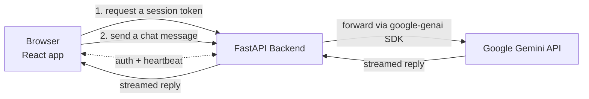

# EchoBot Voice Assistant

EchoBot is an AI assistant you can talk to or type to, with responses streaming back in real time.

[](https://github.com/aaadnan259/EchobotVoiceAssistant/actions/workflows/ci.yml)

## What is EchoBot?

EchoBot is a chat assistant powered by Google's Gemini models. You can type a message or dictate one using your browser's speech recognition, and have EchoBot's replies read back to you. Responses stream in as they're generated instead of appearing all at once, and you can attach images to a conversation alongside text.

EchoBot also works as an installable app: add it to your home screen or desktop, and previously loaded parts of the app continue to work offline.

## Features

- **Conversational chat** with responses streamed in as they're generated.
- **Voice input and output** — dictate messages and have replies read aloud, using your browser's built-in speech support.
- **Image input** alongside text in a conversation.
- **Conversation branching and export/import** for managing and revisiting chat history.
- **Installable, offline-capable app (PWA)**.
- **Plugin architecture** for extending the assistant (calculator, reminders, weather, web search, Wikipedia, time). This is implemented and tested infrastructure, not yet connected to the live chat experience — see [How It Works](#how-it-works).

## Quick Start

### 1. Clone the repository

```bash
git clone https://github.com/aaadnan259/EchobotVoiceAssistant.git
cd EchobotVoiceAssistant
```

### 2. Install dependencies

```bash
# Backend (Python)
pip install -r requirements.txt

# Frontend (Node)
npm install
```

### 3. Configure your environment

```bash
cp .env.example .env
```

Then open `.env` and add your Gemini API key — see [Configuration](#configuration) below.

### 4. Start the app

EchoBot runs as two processes locally — start each in its own terminal:

```bash
# Terminal 1 — backend, http://localhost:8000
python main.py
```

```bash
# Terminal 2 — frontend, http://localhost:3000
npm run dev
```

Open `http://localhost:3000` in your browser.

## Configuration

At minimum, EchoBot needs a Gemini API key to respond to messages. Everything else in `.env.example` has a working default for local development.

| Variable | Required locally | What it's for |
|---|---|---|
| `GOOGLE_API_KEY` | **Yes** | Your Gemini API key ([get one here](https://aistudio.google.com/)). `GEMINI_API_KEY` also works, if you already use that name. |
| `SESSION_SECRET` | No | Signs session tokens. A development value is generated automatically if left unset — fine locally, not for production. |
| `FRONTEND_URL` | No | Only needed in production, to tell the backend which origin to accept requests from. Local development already works out of the box. |
| `FEATURES_PLUGINS` | No | Set to `true` to enable the plugin/memory subsystem locally. |

Production deployment uses a few additional variables that aren't needed for local development — see `render.yaml`.

## How It Works

EchoBot has a React frontend and a Python (FastAPI) backend. The backend is the only thing that talks to Gemini — your API key lives on the server and is never sent to the browser.

- The frontend requests a short-lived session token from the backend, then sends chat messages to it using that token.
- The backend forwards each message to Gemini through the `google-genai` SDK and streams the reply back to the browser as it's generated.
- A separate WebSocket connection handles session authentication and a periodic heartbeat — it does not carry chat messages.
- In production, the same backend also serves the built frontend, so the whole app runs as one deployed service.



## Tech Stack

| Layer | Technology |
|---|---|
| Frontend | React, TypeScript, Vite, Tailwind CSS |
| Backend | FastAPI (Python) |
| AI | Google Gemini (`google-genai` SDK) |
| Deployment | Docker, Render |
| CI | GitHub Actions |

## Project Structure

```
src/                  React frontend
web/backend/          FastAPI application
services/             Backend services (Gemini client, plugins, audio, memory)
plugins/              Plugin implementations
tests/                Backend test suite
render.yaml           Render deployment configuration
Dockerfile            Production build
```

## Development

```bash
npm run dev         # frontend with hot reload
npm run typecheck   # TypeScript check
npm test            # frontend tests, watch mode
python main.py      # backend
```

## Testing

The repository has four layers of automated verification, run in CI on every pull request:

```bash
# Backend tests
pip install -r requirements-dev.txt
pytest tests/

# Frontend: type-check, tests, production build
npm run typecheck
npx vitest run
npm run build
```

## Deployment

```
Feature branch -> Pull request -> Required CI checks -> main -> Render -> Production
```

- `main` is a protected branch: changes go through a pull request, and both CI checks must pass before it can be merged.
- CI verifies the code (tests, type-checking, a production build) — it does not deploy anything.
- Render watches `main` and deploys automatically whenever it changes. Feature branches and pull requests are never deployed.

## Contributing

1. Create a branch off `main`.
2. Open a pull request — both CI checks need to pass before it can merge.
3. Keep pull requests small and focused.

## Troubleshooting

- **Chat requests fail with a server error** — make sure `GOOGLE_API_KEY` (or `GEMINI_API_KEY`) is set in your `.env`.
- **The backend shows a "Frontend not built" error** — run `npm run build` first, or use `npm run dev` for local development instead of a production build.
- **The first request feels slow** — Render's free tier spins the service down when idle; the first request after a period of inactivity can take about a minute while it starts back up.
